# CONTINUOUS INTEGRATION PROJECT USING AWS CODEPIPELINE

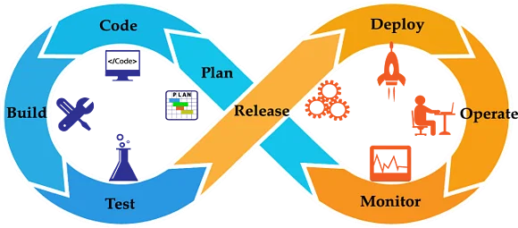

## INTRODUCTION
<p> Continuous Integration (CI) is a cornerstone practice in Agile development methodologies, revolutionizing the way software is built, tested, and delivered. In an era where software development cycles are increasingly demanding speed, flexibility, and quality, CI stands as a critical enabler of Agile principles. It's a powerful approach that promotes collaboration, ensures code stability, and accelerates the release of high-quality software.</p> 

<p>At its core, CI is a development practice that encourages team members to integrate their code frequently. It's more than just a technical process; it's a cultural shift in how software is crafted. With CI, developers no longer work in isolation on separate pieces of code for extended periods. Instead, they continuously merge their code into a shared repository, triggering automated builds and tests.</p>

<p>In this evolving landscape of software development, where customer needs and market dynamics changes rapidly, Continuous Integration acts as a bridge between code creation and value delivery. It promotes the principles of adaptability, customer-centricity, and incremental progress. By doing so, it's not just a practice; it's a fundamental driver of success in Agile development, ensuring that software remains a nimble, high-quality, and valuable asset in a constantly changing world.</p>

## AIM AND OBJECTIVES
### AIM
<P> The aim of this project is to utilise a cloud native solution towards improving software quality by automating test and validation processes.</P>

### OBJECTIVES
<p>The objectives of this project are: </p>

#

- To implement automated build and compilation processes, ensuring that code is built correctly and consistently.

- To automate the testing process, in order to validate code changes, including unit tests, integration tests, and end-to-end tests.

- To implement automated monitoring and alerts to detect and respond to issues quickly.

- To reduce manual intervention and errors in the software delivery process, making it more efficient and reliable.
- To incorporate security checks and testing into the CI/CD pipeline to identify and address security vulnerabilities early.

- To use AWS CodePipeline to optimize costs by minimizing the use of resources when not required.
  
- To facilitate the integration of various tools and services used in the development and deployment process, such as version control systems, testing frameworks, and cloud platforms.

# Technologies 
- Spring MVC
- Spring Security
- Spring Data JPA
- Maven 3 or later version
- JSP
- JDK 8 (correto8) and JDK 11
- MySQL version 5.6 or later
- AWS CodePipeline
- AWS CodeCommit
- AWS CodeBuild
- Sonar Cloud
- AMAZON SNS
- S3 Bucket

# ARCHITECTURE OVERVIEW

## ARCHITECTURAL-DIAGRAM

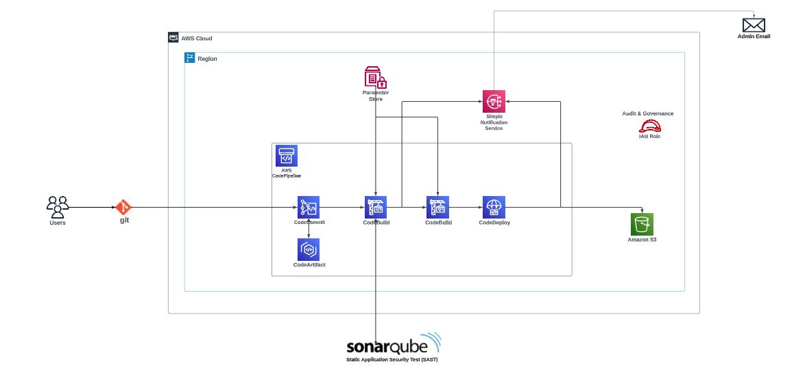

- [x] AWS CodeCommit :- AWS CodeCommit is a fully managed source control service provided by Amazon Web Services (AWS). It is a version control service that makes it easy for teams to host secure and highly scalable Git repositories. In this project, AWS CodeCommit was used to host the java applcation source control. This service offers a seamless integration with other AWS resources, which helps increase the speed and frequency of software development cycle.

- [x] AWS CodeArtifact :- AWS CodeArtifact is a fully managed software package repository service provided by Amazon Web Services (AWS). It is designed to help developers and organizations securely store, publish, and share software packages. AWS CodeArtifact serves as a central hub for managing dependencies, enabling teams to streamline their software development and deployment processes. In this project, the  CodeArtifact was used to store MVN package manager, which would be used during the build stage of the project.

- [x] AWS CodeBuild :- AWS CodeBuild is a fully managed continuous integration service, provided by Amazon Web Services (AWS). It is designed to help developers build, test, and package their code quickly and efficiently. AWS CodeBuild can be integrated into the software development workflow to automate the build and test phases. In this project, AWS codebuild was integrated with SonarQube, to perform code analysis, with Maven to perform unit test, checkstyle test and to build the code artifact, which was stored in an Amazon S3 bucket.

- [x] AWS CodePipeline :- AWS CodePipeline is a continuous integration and continuous delivery (CI/CD) service, provided by Amazon Web Services (AWS). It automates the build, test, and deployment phases of a software release process, enabling the delivery of software and updates more rapidly and reliably. AWS CodePipeline helps to streamline software delivery pipeline, from code changes to production deployments.

- [x] Amazon S3 :- Amazon S3 (Amazon Simple Storage Service) is an object storage service provided by Amazon Web Services (AWS). It is designed to store and retrieve any amount of data, from anywhere on the web. In this project, the Amazon S3 was used to store the Software dependencies, and artifacts after a successful build process. This dependencies stored in the S3 bucket, would later be referenced during the deploy stage of the pipeline to generate an artifact.

- [x] Amazon SNS :- Amazon Simple Notification Service (Amazon SNS) is a fully managed messaging service provided by Amazon Web Services (AWS). It allows send messages and notifications to be sent to a large number of recipients through various communication channels, such as email, SMS (Short Message Service), application endpoints (e.g., mobile devices), and even HTTP endpoints. In this project, the SNS was used to send information about the build and test stages success, failure, code changes, and process termination, to an administrative email.

- [x] SonarCloud :- SonarCloud is a cloud-based, software quality and security platform provided by SonarSource. It's designed to help development teams ensure the quality, maintainability, and security of their code throughout the software development lifecycle. SonarCloud is a part of the larger SonarQube ecosystem but is hosted and maintained by SonarSource, making it a convenient choice for teams looking for a cloud-based solution. In this project, SonarQube was used to perform static application security test on the project source code at build stage. The SAST test was carried out to identify vulnerabilities in the source code, that could be exploited by attack vectors.

# FLOW OF EXECUTION (PROJECT IMPLEMENTATION)
<p>The endeavour at hand can be comprehensively broken down into a seriies of orchestrated stages. These sequential steps form the backbone of the project's execution, thus ensuring a structured and systematic approach towards a successful implemenmtation. without wasting time, i shall briefly explain each stage of the projec's execution: </p>

### 1. AWS CodeCommit
<p> This is the first stage of the continuous integration process, and the steps taken to create an AWS CodeCommit repository are:</p>

- From the AWS management console, the region "US-east-1" was selected. Then, CodeCommit was enetered into the searchbar on the management console.
- A vprofile-code-repo repository was created.
- After the repository was created, an IAM user with CodeCommit Full access was created. This would grant the IAM user full access to every repository in CodeCommit. Although a custom policy can be created to grant the IAM user access to the "vprofile-code-repo" repository only. This is recommended if there are more than one person working on a pipeline.
- For this project, the SSH connection method was the preferred option. This method was chosen because only a single team member was working on the project. For a team project, the HTTPS connection method is suitable. An SSH key was generated from a Linux development machine, and then the public key (id_rsa.pub) exchanged with the IAM user.

```
    $ sudo ssh-keygen
    $ sudo cat ~/.ssh/id_rsa.pub
```
- The configuration under ~/.ssh/config was updated with the host information, and the permission was changed to 600

```
    HOST git-codecommit.us-east-1.amazonaws.com
        User <SSH_Key_ID_From_IAM_user> 
        IdentityFile ~/.ssh/id_rsa
```

- The SSH connection was tested to CodeCommit.

```
    $ sudo ssh git-codecommit.us-east-1.amazonaws.com
```

- From the project root directory, the following command were executed to initialize, commit, and push the project to the CodeCommit repository "vprofile-code-repo"

```
  $ git add .
  $ git commit -m "First commit"
  $ git branch -M master
  $ git remote add origin ssh://git-codecommit.us-east-1.amazonaws.com/v1/repos/vprofile-code-repo
  $ git push origin master

```
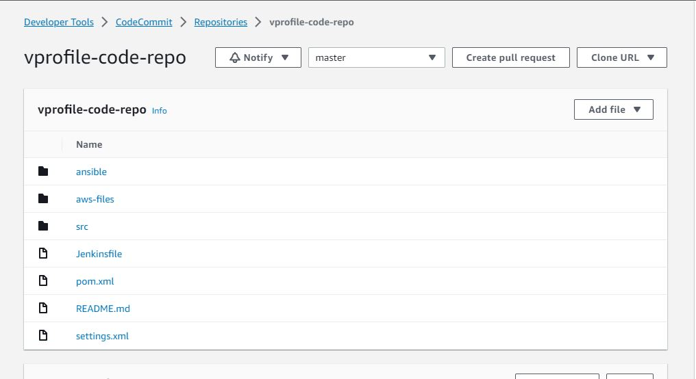

### 2. AWS CodeArtifact
<p> This is the second stage of the continuous integration process, and the steps taken to create an AWS CodeArtifact repository for Maven are: </p>

- A CodeArtifact repository for Maven was created with the following configuration details:

```
   Name: vprofile-code-artifact
   Public Upstream Repo: maven-central-store
   AWS account: This AWS account
   Domain name: vprofile-codertifact-domain

```
- An IAM user for CodeArtifact was created with a AWSCodeArtifactAdminAccess. Programmatic access was also given to the user to enable use of aws cli. the credentials was downloaded.

```
  $ sudo aws configure # The IAM credentials was provided in the prompt

```
- By Navigating to Developer Tools > CodeArtifact > Domains > vprofile-codertifact-domain > maven-central-store
- "View connection instructions" was selected, linux was selected as the operating system, and mvn was selected as the package manager client.
- The following was copied and pasted on the terminal of the development machine

```
  $ export CODEARTIFACT_AUTH_TOKEN=`aws codeartifact get-authorization-token --domain vprofile-codertifact-domain --domain-owner 337070252184 --region us-east-1 --query authorizationToken --output text`

```
<p>It should be noted that the generated token expires after 12 hours from generation. An attempt to run a CodePipeline would generate a 401 Unauthorized error !!! should this occur, a new token must be generated and pasted in the development machine.</p>

- The following configuration settings were compared to the [settings.xml](https://github.com/ogunleye0720/AWS-continuous-integration/blob/master/settings.xml) file, and updated with some of the configuration data from the connection instructions page. below is the configuration data from the connection instructions page:

```
  <servers>
  <server>
    <id>vprofile-codertifact-domain-maven-central-store</id>
    <username>aws</username>
    <password>${env.CODEARTIFACT_AUTH_TOKEN}</password>
  </server>
</servers>
<profiles>
  <profile>
    <id>vprofile-codertifact-domain-maven-central-store</id>
    <activation>
      <activeByDefault>true</activeByDefault>
    </activation>
    <repositories>
      <repository>
        <id>vprofile-codertifact-domain-maven-central-store</id>
        <url>https://vprofile-codertifact-domain-337070252184.d.codeartifact.us-east-1.amazonaws.com/maven/maven-central-store/</url>
      </repository>
    </repositories>
  </profile>
</profiles>
<mirrors>
  <mirror>
    <id>vprofile-codertifact-domain-maven-central-store</id>
    <name>vprofile-codertifact-domain-maven-central-store</name>
    <url>https://vprofile-codertifact-domain-337070252184.d.codeartifact.us-east-1.amazonaws.com/maven/maven-central-store/</url>
    <mirrorOf>*</mirrorOf>
  </mirror>
</mirrors>

```
- Below is the updated [settings.xml](https://github.com/ogunleye0720/AWS-continuous-integration/blob/master/settings.xml) file content:

```
  <?xml version="1.0" encoding="UTF-8"?>
<settings xmlns="http://maven.apache.org/SETTINGS/1.0.0"
  xmlns:xsi="http://www.w3.org/2001/XMLSchema-instance"
  xsi:schemaLocation="http://maven.apache.org/SETTINGS/1.0.0 http://maven.apache.org/xsd/settings-1.0.0.xsd">
  <servers>
        <server>
            <id>vprofile-codertifact-domain-vprofile-code-artifact</id>
            <username>aws</username>
            <password>${env.CODEARTIFACT_AUTH_TOKEN}</password>
        </server>
    </servers>
<profiles>
  <profile>
    <id>vprofile-codertifact-domain-vprofile-code-artifact</id>
    <repositories>
      <repository>
        <id>vprofile-codertifact-domain-vprofile-code-artifact</id>
        <url>https://vprofile-codertifact-domain-337070252184.d.codeartifact.us-east-1.amazonaws.com/maven/vprofile-code-artifact/</url>
      </repository>
    </repositories>
  </profile>
</profiles>
<activeProfiles>
        <activeProfile>default</activeProfile>
</activeProfiles>
<mirrors>
  <mirror>
    <id>vprofile-codertifact-domain-vprofile-code-artifact</id>
    <name>vprofile-codertifact-domain-vprofile-code-artifact</name>
    <url>https://vprofile-codertifact-domain-337070252184.d.codeartifact.us-east-1.amazonaws.com/maven/vprofile-code-artifact/</url>
    <mirrorOf>*</mirrorOf>
  </mirror>
</mirrors>
</settings>

```
- The [pom.xml](https://github.com/ogunleye0720/AWS-continuous-integration/blob/master/pom.xml) file was also updated with instructions from the connection instructions page, the updated pom.xml file content:

```
  <project xmlns:xsi="http://www.w3.org/2001/XMLSchema-instance" xmlns="http://maven.apache.org/POM/4.0.0"
         xsi:schemaLocation="http://maven.apache.org/POM/4.0.0 http://maven.apache.org/maven-v4_0_0.xsd">
    <modelVersion>4.0.0</modelVersion>
    <groupId>com.visualpathit</groupId>
    <artifactId>vprofile</artifactId>
    <packaging>war</packaging>
    <version>v2</version>
    <name>Visualpathit VProfile Webapp</name>
    <url>http://maven.apache.org</url>
    <properties>
    <timestamp>${maven.build.timestamp}</timestamp>
        <maven.build.timestamp.format>yyyy-MM-dd_HHmm</maven.build.timestamp.format>
        <spring.version>4.2.0.RELEASE</spring.version>
        <spring-security.version>4.0.2.RELEASE</spring-security.version>
        <spring-data-jpa.version>1.8.2.RELEASE</spring-data-jpa.version>
        <hibernate.version>4.3.11.Final</hibernate.version>
        <hibernate-validator.version>5.2.1.Final</hibernate-validator.version>
        <mysql-connector.version>5.1.36</mysql-connector.version>
        <commons-dbcp.version>1.4</commons-dbcp.version>
        <jstl.version>1.2</jstl.version>
        <junit.version>4.10</junit.version>
        <logback.version>1.1.3</logback.version>
        <maven.compiler.source>1.8</maven.compiler.source>
        <maven.compiler.target>1.8</maven.compiler.target>
    </properties>

    <dependencies>
        <dependency>
            <groupId>org.springframework</groupId>
            <artifactId>spring-web</artifactId>
            <version>${spring.version}</version>
        </dependency>
        
        <dependency>
            <groupId>org.springframework</groupId>
            <artifactId>spring-webmvc</artifactId>
            <version>${spring.version}</version>
        </dependency>
        
        <dependency>
            <groupId>org.springframework.security</groupId>
            <artifactId>spring-security-web</artifactId>
            <version>${spring-security.version}</version>
        </dependency>

        <dependency>
            <groupId>org.springframework.security</groupId>
            <artifactId>spring-security-config</artifactId>
            <version>${spring-security.version}</version>
        </dependency>

        <dependency>
            <groupId>org.hibernate</groupId>
            <artifactId>hibernate-validator</artifactId>
            <version>${hibernate-validator.version}</version>
        </dependency>

        <dependency>
            <groupId>org.springframework.data</groupId>
            <artifactId>spring-data-jpa</artifactId>
            <version>${spring-data-jpa.version}</version>
        </dependency>

        <dependency>
            <groupId>org.hibernate</groupId>
            <artifactId>hibernate-entitymanager</artifactId>
            <version>${hibernate.version}</version>
        </dependency>

        <dependency>
            <groupId>mysql</groupId>
            <artifactId>mysql-connector-java</artifactId>
            <version>${mysql-connector.version}</version>
        </dependency>

        <dependency>
            <groupId>commons-dbcp</groupId>
            <artifactId>commons-dbcp</artifactId>
            <version>${commons-dbcp.version}</version>
        </dependency>

        <dependency>
            <groupId>javax.servlet</groupId>
            <artifactId>jstl</artifactId>
            <version>${jstl.version}</version>
        </dependency>

        <dependency>
            <groupId>junit</groupId>
            <artifactId>junit</artifactId>
            <version>${junit.version}</version>
            <scope>test</scope>
        </dependency>
        <dependency>
        <groupId>org.mockito</groupId>
            <artifactId>mockito-core</artifactId>
            <version>1.9.5</version>
            <scope>test</scope>
    </dependency>
    <dependency>
         <groupId>org.springframework</groupId>
         <artifactId>spring-test</artifactId>
         <version>3.2.3.RELEASE</version>
         <scope>test</scope>
    </dependency>
    <dependency>
         <groupId>javax.servlet</groupId>
         <artifactId>javax.servlet-api</artifactId>
         <version>3.1.0</version>
         <scope>provided</scope>
    </dependency>       
        <dependency>
            <groupId>ch.qos.logback</groupId>
            <artifactId>logback-classic</artifactId>
            <version>${logback.version}</version>
        </dependency>
        <dependency>
            <groupId>org.hamcrest</groupId>
            <artifactId>hamcrest-all</artifactId>
            <version>1.3</version>
            <scope>test</scope>
        </dependency>
            <dependency>
            <groupId>commons-fileupload</groupId>
            <artifactId>commons-fileupload</artifactId>
            <version>1.3.1</version>
        </dependency>
         <!-- Memcached Dependency -->
        <dependency>
            <groupId>net.spy</groupId>
            <artifactId>spymemcached</artifactId>
            <version>2.12.3</version>
        </dependency>               
        <dependency>
            <groupId>commons-io</groupId>
            <artifactId>commons-io</artifactId>
            <version>2.4</version>
        </dependency>
        <!-- RabbitMQ Dependency -->
        <dependency>
                <groupId>org.springframework.amqp</groupId>
                <artifactId>spring-rabbit</artifactId>
                <version>1.7.1.RELEASE</version>
        </dependency>
    
        <dependency>
                <groupId>com.rabbitmq</groupId>
                <artifactId>amqp-client</artifactId>
                <version>4.0.2</version>
       </dependency>
       <!-- Elasticsearch Dependency-->
        <dependency>
            <groupId>org.elasticsearch</groupId>
            <artifactId>elasticsearch</artifactId>
            <version>5.6.4</version>
        </dependency>
        <!-- Transport Client-->
        <dependency>
            <groupId>org.elasticsearch.client</groupId>
            <artifactId>transport</artifactId>
            <version>5.6.4</version>
        </dependency>
        <!--gson -->
        <dependency>
            <groupId>com.google.code.gson</groupId>
            <artifactId>gson</artifactId>
            <version>2.8.2</version>
        </dependency>
    </dependencies>
     <build>
     <finalName>${project.artifactId}-${project.version}-${timestamp}</finalName>
        <plugins>
            <plugin>
                <groupId>org.eclipse.jetty</groupId>
                <artifactId>jetty-maven-plugin</artifactId>
                <version>9.2.11.v20150529</version>
                <configuration>
                    <scanIntervalSeconds>10</scanIntervalSeconds>
                    <webApp>
                        <contextPath>/</contextPath>
                    </webApp>
                </configuration>
            </plugin>
        <!-- CODE COVERAGE -->
            <plugin>
                     <groupId>org.apache.maven.plugins</groupId>
                     <artifactId>maven-war-plugin</artifactId>
                     <version>3.2.2</version>
                    </plugin>
 		    <plugin>
 		        <groupId>org.jacoco</groupId>
 		        <artifactId>jacoco-maven-plugin</artifactId>
                <version>0.8.4</version>
                <executions>
                    <execution>
                        <id>jacoco-initialize</id>
                        <phase>process-resources</phase>
                        <goals>
                            <goal>prepare-agent</goal>
                        </goals>
                    </execution>
                    <execution>
                        <id>jacoco-site</id>
                        <phase>post-integration-test</phase>
                        <goals>
                            <goal>report</goal>
                        </goals>
                    </execution>
                </executions>
        </plugin>
        </plugins>
    </build>
  <repositories>
      <repository>
        <id>vprofile-codertifact-domain-vprofile-code-artifact</id>
        <name>vprofile-codertifact-domain-vprofile-code-artifact</name>
    <url>https://domainame-accountid.d.codeartifact.regioncode.amazonaws.com/maven/maven-central-store/</url>
      </repository>
    </repositories>
</project>

```
- The updates were added, committed and pushed to the AWS CodeCommit repository

```
  $ git add .
  $ git commit -m "updated settings.xml and pom.xml"
  $ git push origin master

```
### 3. SonarCloud Configuration
- open [sonarcloud.io](https://sonarcloud.io)
- An account was created
- From the account avatar icon on the top right corner of the navbar > click on the avatar > select My Account > on the account page, select Security on the navbar.
```
  Generate Tokens: Enter Token Name

```
- Click on the Generate Token button as shown in the image below: The Generated Token was stored in a safe file for later use.

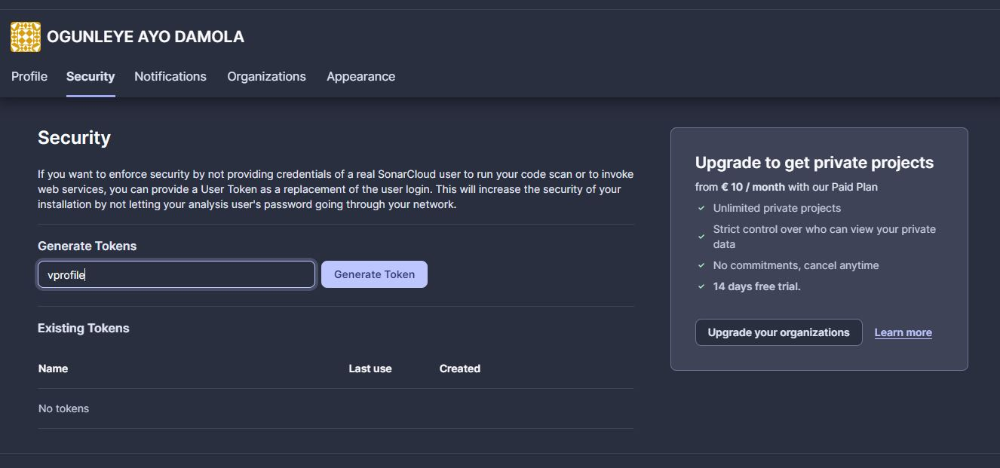

- On the SonarCloud main navbar, click on My Projects, create a new project > Select Analyze Project > create project manually. The Below details will be used in the CodeBuild stage.

```
  Organization: The displayed details
  Project Key: The displayed project key

```
### 4. System Manager Configuration
- System manager was searched from the AWS management console search bar. 
- From system manager > Parameter store > Create parameter
- The following details were entered for the various parameters to be used:

```
  Name: Organization
  Tier: standard
  Type string
  Data type: text
  value: name of the organization on SonarCloud

```
```
  Name: HOST
  Tier: standard
  Type string
  Data type: text
  value: SonarCloud URL https://sonarcloud.io

```
```
  Name: codeartifact-token
  Tier: standard
  Type SecureString
  value: value of the generated token  from development machine $ sudo echo $CODEARTIFACT_AUTH_TOKEN

```
```
  Name: Project
  Tier: standard
  Type string
  Data type: text
  value: SonarCloud project name

```

```
  Name: sonartoken
  Tier: standard
  Type SecureString
  value: SonarCloud Generated Token

```

### 5. AWS CodeBuild for SonarQube Code Analysis
- From AWS mannagement console > Search For CodeBuild > Create Build Project
- The Follwing data were filled in the Create Build Project page for Sonarbuild:

```
  Project name: vprofile-sonarbuild
  Description: Build Job for sonar analysis
  Source provider: AWS CodeCommit
  Repository: vprofile-code-repo
  Branch: master
  Environment image: Managed image
  Operating system: Ubuntu
  Runtime: standard
  image: aws/codebuild/standard:5.0
  Service role: New service role
  Role name: codebuild12-vprofile-Build-service-role
  Buildspec: Insert build commands <!-- copy and paste the content from --> [sonar_buildspec.yml](https://github.com/ogunleye0720/AWS-continuous-integration/blob/master/aws-files/sonar_buildspec.yml)
  CloudWatch Logs: vprofile-nvirginia-buildlogs
  Stream name: sonarbuildjob

```
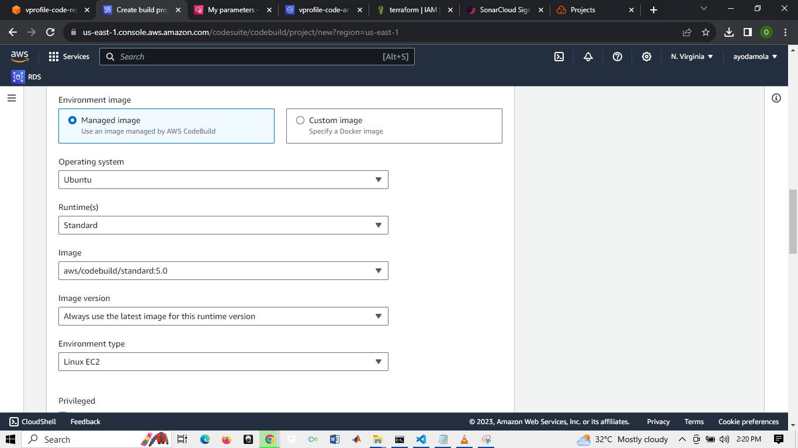

- The sonar_buildspec.yml file was updated with the parameters from the system manager parameter store

```
  env:
  parameter-store:
    LOGIN: sonartoken
    HOST: HOST
    Organization: Organization
    Project: project
    CODEARTIFACT_AUTH_TOKEN: codeartifact-token

```
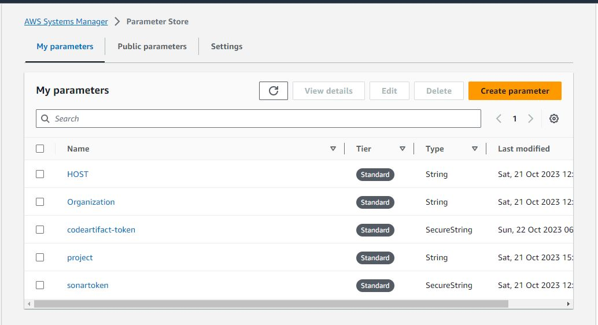

- From the IAM console > Role > codebuild12-vprofile-Build-service-role
- A Policy was attached to the role. This policy grants System Manager permission to  the role. This would allow the role make use of the parameters in the parameter store.
- The permissions attached are:

```
in List:
  DescribeParameters

in Read:
  GetParameter
  GetParameters
  GetParameterHistory
  GetParameterByPath
  DescribeDocumentParameters

```
- Back to the Build Project, the Start Build button was clicked for the vprofile-sonarbuild project.
- The outcome of the build project:

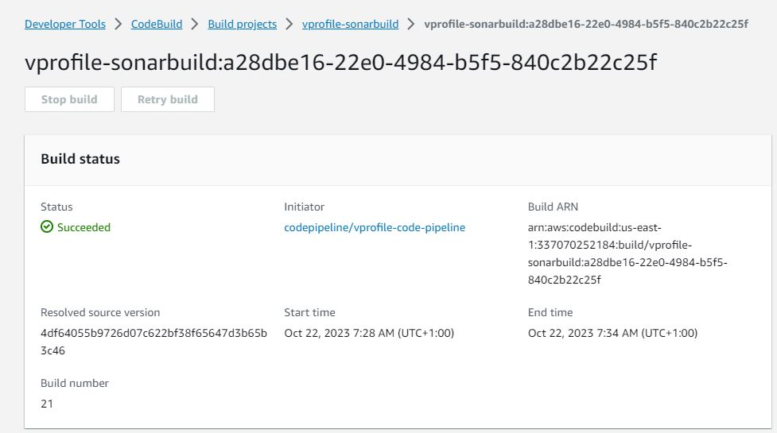
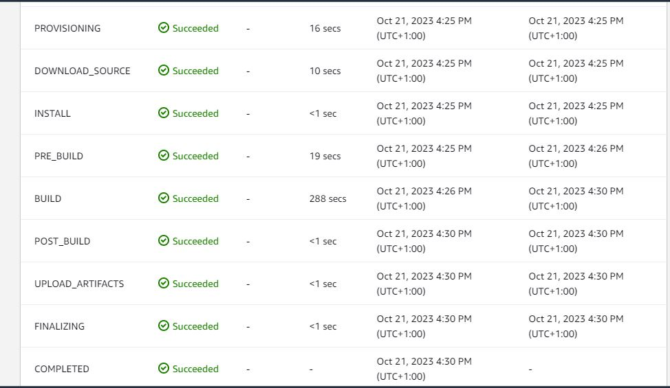

- Result of the code analysis performed using SonarQube after setting Quality gate to fail the job if the number of Bugs detected > 40

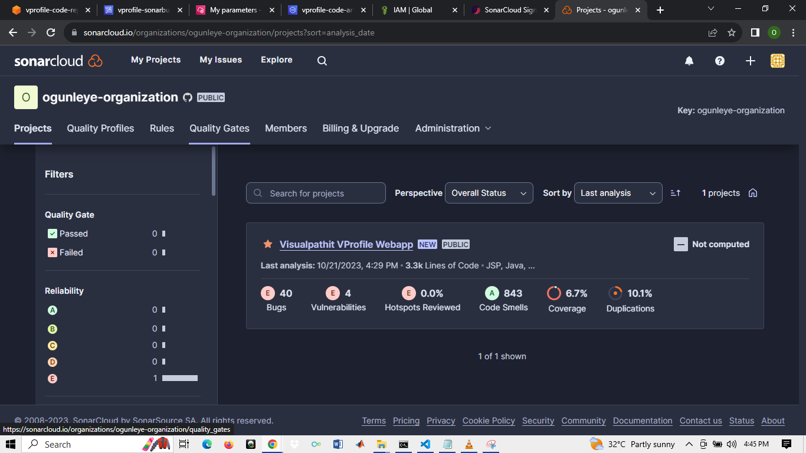

### 6. AWS CodeBuild for Build Artifact
- From AWS mannagement console > Search For CodeBuild > Create Build Project
- The Follwing data were filled in the Create Build Project page for Build Artifact:
```
  Project name: vprofile-Artifact-codeBuild
  Description: vprofile-Artifact-codeBuild
  Source provider: AWS CodeCommit
  Repository: vprofile-code-repo
  Branch: master
  Environment image: Managed image
  Operating system: Ubuntu
  Runtime: standard
  image: aws/codebuild/standard:5.0
  Service role: New service role
  Role name: codebuild12-vprofile-Build-Artifact-service-role
  Buildspec: Insert build commands <!-- copy and paste the content from build_buildspec.yml file --> 
  CloudWatch Logs: vprofile-nvirginia-buildlogs
  Stream name: buildjob

```
- From the IAM console > Role > codebuild12-vprofile-Build-Artifact-service-role
- A Policy was attached to the role. This policy grants System Manager permission to  the role. This would allow the role make use of the parameters in the parameter store.
- The permissions attached are:

```
in List:
  DescribeParameters

in Read:
  GetParameter  
  GetParameters 
  GetParameterHistory
  GetParameterByPath
  DescribeDocumentParameters

```
- The outcome of the build project:

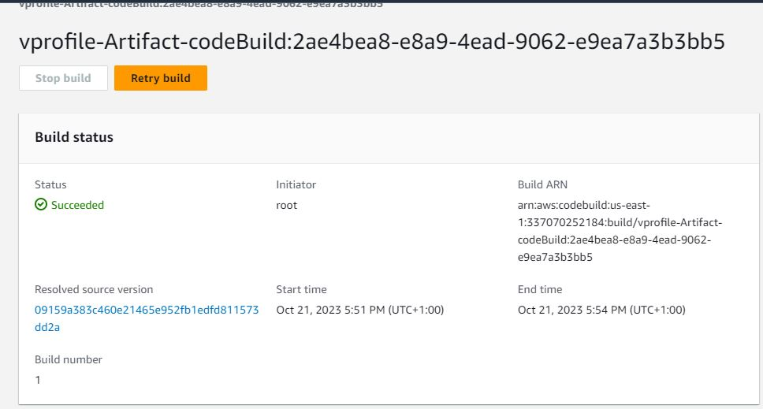

### 7. AWS CodePipeline and SNS Notification
- From AWS mannagement console > Search For CodePipeline > Pipelines > Create Pipeline

```
  Pipeline name: vprofile-code-pipeline
  Service role: New service role
  Role name: AWSCodePipelineServiceRole-us-east-1-vprofile-code-pipeline
  Source provider: AWS CodeCommit
  Repository: vprofile-code-repo
  Branch: master
  Change detection options: Cloudwatch events
  Build provider: AWS CodeBuild
  Project name: vprofile-Artifact-codeBuild
  Build type: Single build
  Deploy provider: Amazon S3

```
- Then the Deploy stage was skipped, and the execution was stopped by clicking the stop execution button.
- The pipeline without the deploy stage after skipping deploy stage, and stopping execution:
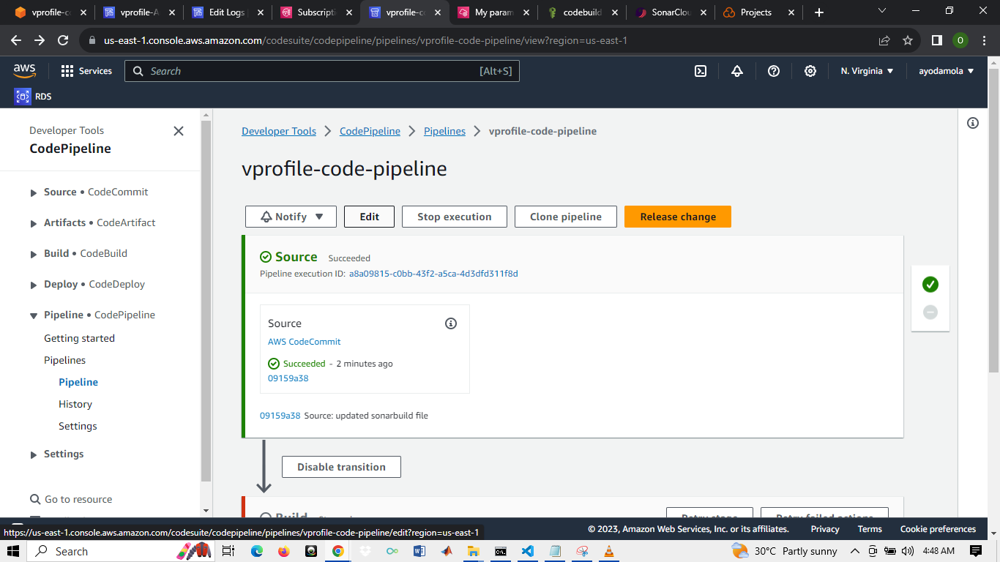

- The pipeline was edited by clicking the Edit button
- On the edit pipeline page, another stage was added just after the CodeCommit stage.

```
  stage name: Test
  click Add stage
  on the Test stage secion, click Add action group
  Action name: sonar-code-analysis
  Action provider: AWS CodeBuild
  Input artifacts: SourceArtifact
  Project name: vprofile-sonarbuild
  Build type: Single build
  Output Artifact: BuildArtifactSonar
  
```
- On the edit pipeline page, another stage was added just after the Build stage, This was the last stage.
- In this stage, the artifact was built and deployed to Amazon S3 bucket

```
  stage name: deploy
  click Add stage
  on the Test stage secion, click Add action group
  Action name: deploy-to-s3
  Action provider: Amazon s3
  Input artifacts: BuildArtifact
  Bucket: codepipeline-us-east-1-844910341280
  S3 object key: buildArtifact
  Deployment path: vprofile-build-artfifact

```
- From aws management console > search SNS > Create topic 
```
  Name: vprofile-build-artifact

```
- from Amazon SNS > Subscription 
```
  Topic: arn:aws:sns:us-east-1:337070252184:vprofile-build-artifact
  Protocol: Email
  End point: email address

```
- The subscription was sent to the email for confirmation

- On the left navbar, under pipeline, settings was selected > Notifications > Create notification rule

```
  Notification name: vprofile-code-pipelineexecution-notification
  Detail type: Full
  Events that trigger notification: Select all
  Choose target type: SNS
  Choose target: arn:aws:sns:us-east-1:337070252184:vprofile-build-artifact    # This was the topic created

```
- The bucket policy of the bucket used to store Artifact was updated
- Amazon S3 > Buckets > codepipeline-us-east-1-844910341280 > Edit Bucket Policy
- The s3:PutObject action Effect was changed from "Deny" to "Allow"
- This enabled the Pipeline role to send files into the bucket
- The Bucket was also made publicly accessible, but Block public and cross-account access to buckets and objects through any public bucket or access point policies was enabled.

- The pipeline was activated by clicking the "Release change" Button

- The outcome of the activated pipeline:
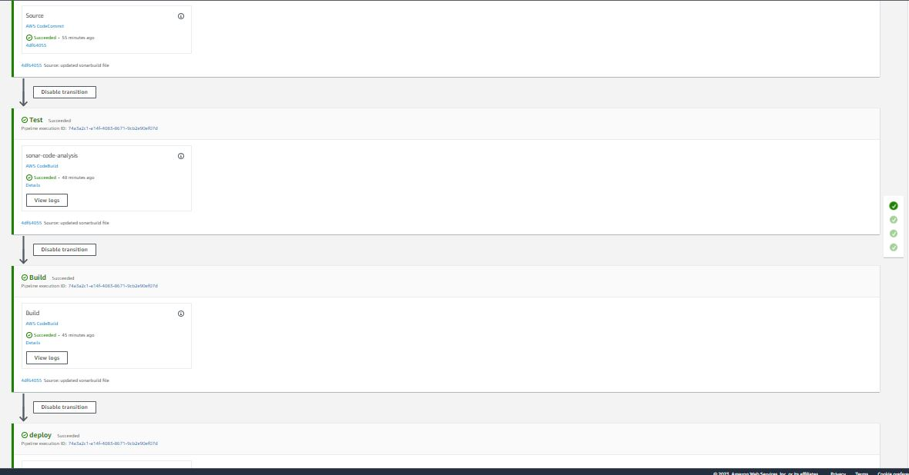

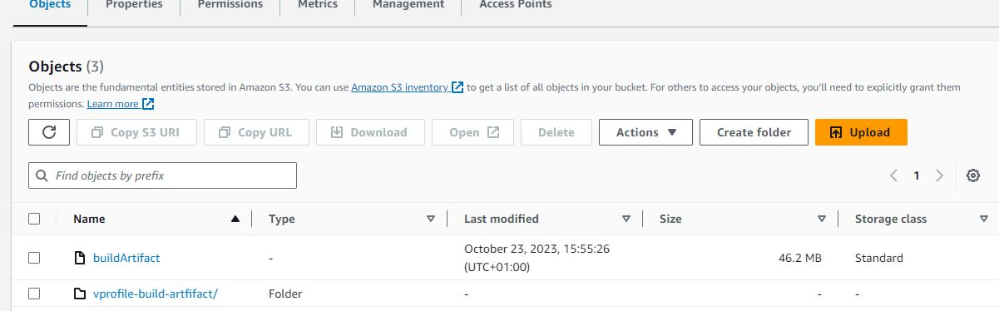

# CHALLENGES AND SOLUTION
